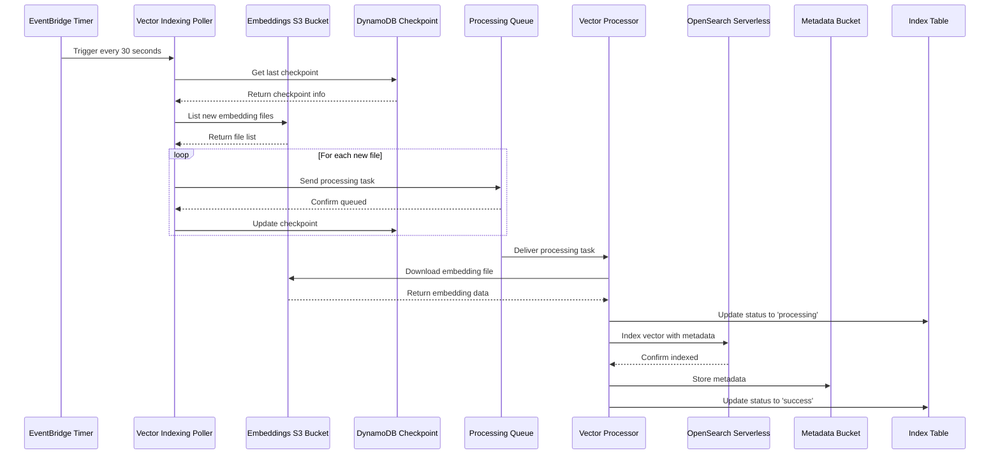
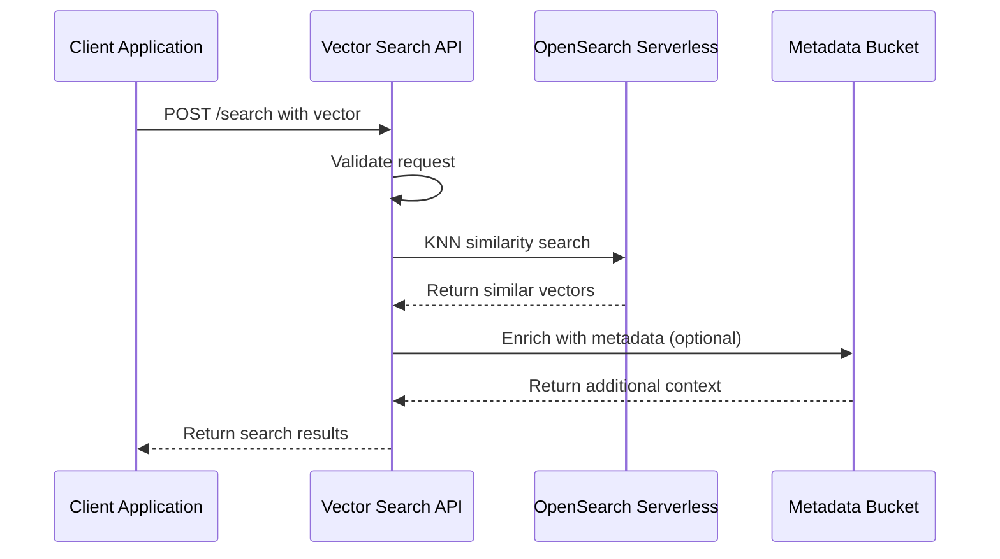
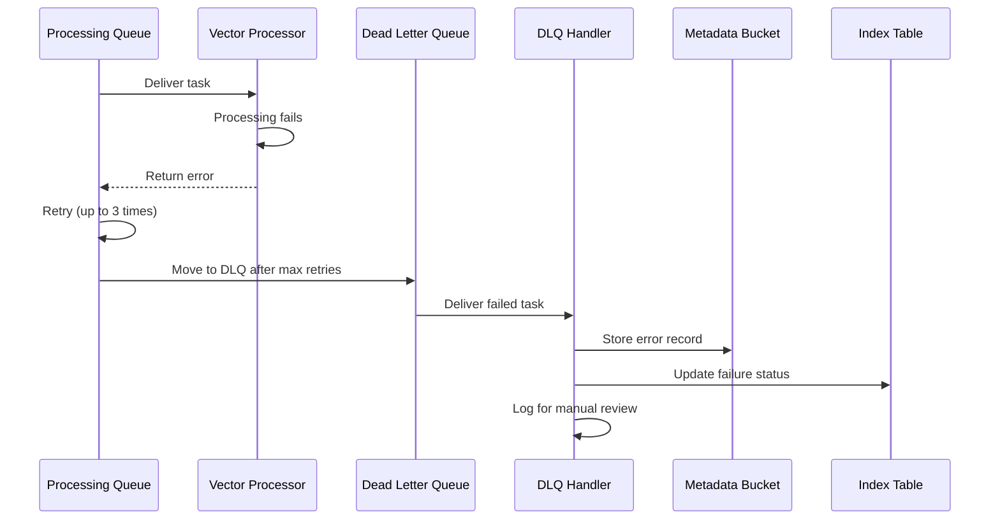

# RAG Vector Storage Service Architecture

## Overview

The Vector Storage Service is a critical component of the RAG (Retrieval-Augmented Generation) pipeline that handles vector indexing and similarity search. It processes completed embeddings from the Embedding Service and stores them in OpenSearch Serverless for high-performance vector similarity search.

## Service Purpose

- **Input**: Completed embedding files from the Embedding Service (stored in S3)
- **Process**: Index vectors into OpenSearch Serverless with metadata
- **Output**: Provide vector similarity search API for the Generation Service

## High-Level Architecture

```
┌─────────────────┐    ┌──────────────────┐    ┌─────────────────┐
│  Embedding      │    │  Vector Storage  │    │  Generation     │
│  Service        │───▶│  Service         │───▶│  Service        │
│                 │    │                  │    │                 │
│ Generates       │    │ Indexes vectors  │    │ Performs        │
│ embeddings      │    │ Provides search  │    │ similarity      │
│ to S3           │    │ API              │    │ search          │
└─────────────────┘    └──────────────────┘    └─────────────────┘
```

## Data Flow Diagram

```
┌─────────────────────────────────────────────────────────────────────────────────────────┐
│                                 Vector Storage Service                                  │
│                                                                                         │
│  ┌─────────────┐   ┌─────────────┐   ┌─────────────┐   ┌─────────────┐                │
│  │   Timer     │   │ Vector      │   │    SQS      │   │   Vector    │                │
│  │ (30 sec)    │──▶│ Indexing    │──▶│ Processing  │──▶│ Processor   │                │
│  │             │   │ Poller      │   │   Queue     │   │             │                │
│  └─────────────┘   └─────────────┘   └─────────────┘   └─────────────┘                │
│                            │                                    │                       │
│                            ▼                                    ▼                       │
│                   ┌─────────────┐                      ┌─────────────┐                │
│                   │ DynamoDB    │                      │ OpenSearch  │                │
│                   │ Checkpoint  │                      │ Serverless  │                │
│                   │ Table       │                      │ Collection  │                │
│                   └─────────────┘                      └─────────────┘                │
│                                                                │                       │
│                                                                ▼                       │
│  ┌─────────────┐   ┌─────────────┐   ┌─────────────┐   ┌─────────────┐                │
│  │   Client    │◀──│   Vector    │◀──│    API      │   │   Vector    │                │
│  │ Application │   │   Search    │   │  Gateway    │   │ Metadata    │                │
│  │             │   │    API      │   │             │   │   Bucket    │                │
│  └─────────────┘   └─────────────┘   └─────────────┘   └─────────────┘                │
│                                                                                         │
└─────────────────────────────────────────────────────────────────────────────────────────┘
```

## Event Flow Sequence

### 1. Vector Indexing Flow



### 2. Vector Search Flow



### 3. Error Handling Flow



## Component Deep Dive

### 1. Vector Indexing Poller

**Purpose**: Continuously monitors the embeddings S3 bucket for new files and queues them for processing.

**Key Features**:
- Checkpoint-based polling (resumes from last processed file)
- Batch processing (50 files per execution)
- Contiguous processing (maintains order)
- Timestamp-hash filename validation

**Data Format Expected**:
```
S3 Key Pattern: YYYY-MM-DDTHH:mm:ss.sssZ-{64-char-hash}.json
Example: 2024-01-15T10:30:45.123Z-a1b2c3d4e5f6...json
```

**Environment Variables**:
- `EMBEDDINGS_BUCKET_NAME`: Source S3 bucket
- `VECTOR_PROCESSING_QUEUE_URL`: Target SQS queue
- `CHECKPOINT_TABLE_NAME`: DynamoDB checkpoint table
- `BATCH_SIZE`: Number of files to process per run

### 2. Vector Processor

**Purpose**: Downloads embedding files from S3 and indexes them into OpenSearch Serverless.

**Processing Steps**:
1. Parse SQS message to get S3 location
2. Download and parse embedding JSON file
3. Update DynamoDB status to 'processing'
4. Create OpenSearch document with KNN vector field
5. Index into OpenSearch Serverless collection
6. Store metadata in S3 for backup/analysis  
7. Update DynamoDB status to 'success'

**OpenSearch Document Structure**:
```json
{
  "vector_field": [0.1, 0.2, 0.3, ...],      // 1024-dimensional vector
  "document_id": "doc-123",
  "processing_id": "proc-456", 
  "chunk_id": "chunk-789",
  "chunk_index": 0,
  "content": "The actual text content...",
  "original_file_name": "document.pdf",
  "content_type": "application/pdf",
  "file_size": 1024000,
  "embedding_model": "amazon.titan-embed-text-v2:0",
  "dimensions": 1024,
  "token_count": 256,
  "processed_at": "2024-01-15T10:30:45.123Z",
  "indexed_at": "2024-01-15T10:31:00.456Z",
  "source": "document-processing-service"
}
```

### 3. Vector Search API

**Purpose**: Provides REST API for vector similarity search.

**API Endpoints**:

#### POST /search
Performs KNN similarity search against the vector database.

**Request Body**:
```json
{
  "vector": [0.1, 0.2, 0.3, ...],          // Required: 1024-dimensional query vector
  "limit": 10,                             // Optional: Number of results (default: 10)
  "threshold": 0.7,                        // Optional: Similarity threshold (default: 0.7)
  "includeContent": true,                  // Optional: Include text content (default: true)
  "filters": {                             // Optional: Metadata filters
    "content_type": "application/pdf",
    "embedding_model": "amazon.titan-embed-text-v2:0"
  }
}
```

**Response**:
```json
{
  "results": [
    {
      "chunkId": "chunk-789",
      "documentId": "doc-123", 
      "processingId": "proc-456",
      "chunkIndex": 0,
      "score": 0.95,
      "content": "The actual text content...",
      "metadata": {
        "originalFileName": "document.pdf",
        "contentType": "application/pdf",
        "fileSize": 1024000,
        "embeddingModel": "amazon.titan-embed-text-v2:0",
        "tokenCount": 256,
        "processedAt": "2024-01-15T10:30:45.123Z",
        "source": "document-processing-service"
      }
    }
  ],
  "totalHits": 25,
  "searchTime": 45,
  "metadata": {
    "indexName": "embeddings-123456789012-us-east-2",
    "searchType": "vector",
    "threshold": 0.7,
    "limit": 10
  }
}
```

### 4. DLQ Handler

**Purpose**: Processes failed vector indexing tasks for monitoring and potential recovery.

**Processing Steps**:
1. Receive failed task from Dead Letter Queue
2. Extract error information and attempt details
3. Store detailed error record in S3 for analysis
4. Update DynamoDB with failure status
5. Log for manual review if needed

**Error Record Structure**:
```json
{
  "originalTask": {
    "embeddingS3Key": "2024-01-15T10:30:45.123Z-a1b2c3d4e5f6...json",
    "embeddingS3Bucket": "rag-embeddings-123456789012-us-east-2",
    "timestamp": "2024-01-15T10:30:45.123Z",
    "taskId": "request-123-0"
  },
  "errorDetails": {
    "errorMessage": "Failed after 3 attempts",
    "attemptCount": 3,
    "firstFailureAt": "2024-01-15T10:30:45.123Z",
    "lastFailureAt": "2024-01-15T10:35:45.123Z",
    "sqsMessageId": "msg-456",
    "sqsReceiptHandle": "handle-789"
  },
  "dlqProcessedAt": "2024-01-15T10:36:00.123Z",
  "status": "requires_manual_review"
}
```

## Infrastructure Components

### OpenSearch Serverless Collection

**Configuration**:
- **Name**: `rag-vector-storage-{account}-{region}`
- **Index**: `embeddings-{account}-{region}`
- **Vector Field**: `vector_field` (1024 dimensions)
- **Encryption**: AWS managed keys
- **Network**: VPC access policies
- **Data**: Collection-level access policies

**Index Mapping**:
```json
{
  "mappings": {
    "properties": {
      "vector_field": {
        "type": "knn_vector",
        "dimension": 1024,
        "method": {
          "name": "hnsw",
          "space_type": "cosinesimil",
          "engine": "nmslib"
        }
      },
      "content": { "type": "text" },
      "document_id": { "type": "keyword" },
      "chunk_id": { "type": "keyword" },
      "chunk_index": { "type": "integer" },
      "embedding_model": { "type": "keyword" },
      "content_type": { "type": "keyword" },
      "processed_at": { "type": "date" },
      "indexed_at": { "type": "date" }
    }
  }
}
```

### S3 Buckets

#### 1. Vector Metadata Bucket
- **Purpose**: Store vector metadata and error records
- **Lifecycle**: 90-day retention, transition to IA after 30 days
- **Structure**:
  ```
  metadata/
    YYYY/MM/DD/
      {chunk-id}-metadata.json
  
  dlq-records/
    YYYY-MM-DDTHH:mm:ss.sssZ-{task-id}-dlq.json
  ```

#### 2. Vector Backup Bucket  
- **Purpose**: Backup vector data for disaster recovery
- **Lifecycle**: 1-year retention, transition to Glacier after 90 days
- **Versioning**: Enabled

### DynamoDB Tables

#### 1. Checkpoint Table
- **Purpose**: Track processing progress for resumable polling
- **Partition Key**: `serviceId` (string)
- **TTL**: 30 days
- **Structure**:
  ```json
  {
    "serviceId": "vector-storage-1",
    "lastProcessedTimestamp": "2024-01-15T10:30:45.123Z",
    "lastProcessedKey": "2024-01-15T10:30:45.123Z-a1b2c3d4e5f6...json",
    "updatedAt": "2024-01-15T10:31:00.456Z"
  }
  ```

#### 2. Vector Index Table
- **Purpose**: Track vector indexing status and metadata
- **Partition Key**: `documentId` (string)
- **Sort Key**: `chunkId` (string)
- **Structure**:
  ```json
  {
    "documentId": "doc-123",
    "chunkId": "chunk-789", 
    "chunkIndex": 0,
    "vectorId": "chunk-789",
    "opensearchIndexName": "embeddings-123456789012-us-east-2",
    "indexingStatus": "success",
    "indexedAt": "2024-01-15T10:31:00.456Z",
    "metadata": {
      "dimensions": 1024,
      "tokenCount": 256,
      "embeddingModel": "amazon.titan-embed-text-v2:0",
      "contentPreview": "The actual text content..."
    }
  }
  ```

### SQS Queues

#### 1. Vector Processing Queue
- **Purpose**: Queue embedding files for vector processing
- **Visibility Timeout**: 15 minutes (matches Lambda timeout)
- **Message Retention**: 14 days
- **Redrive Policy**: 3 attempts before DLQ

#### 2. Dead Letter Queue
- **Purpose**: Handle failed vector processing tasks
- **Message Retention**: 14 days
- **Manual processing**: DLQ Handler Lambda

## Performance Characteristics

### Throughput
- **Poller**: 50 files per 30-second execution = 100 files/minute
- **Processor**: 5 concurrent executions, ~30 seconds per file = 10 files/minute per execution
- **Search API**: ~100ms per KNN search query

### Scaling Considerations
- **Batch Size**: Adjust `BATCH_SIZE` based on processing volume
- **Concurrent Executions**: Processor can scale to handle queue depth
- **OpenSearch**: Serverless auto-scales based on query load

### Cost Optimization
- **S3 Lifecycle**: Automatic transition to cheaper storage classes
- **DynamoDB**: On-demand billing for variable workloads
- **Lambda**: Pay-per-invocation, no idle costs
- **OpenSearch**: Serverless pricing based on actual usage

## Monitoring and Alerting

### CloudWatch Metrics
- **Poller**: Invocations, errors, duration
- **Processor**: Invocations, errors, duration, DLQ messages
- **Search API**: Invocations, latency, errors
- **OpenSearch**: Index size, query latency, error rate

### CloudWatch Alarms
- **DLQ Alarm**: Triggers when DLQ has > 5 messages
- **Processor Error Alarm**: Triggers on high error rate (> 10 errors in 2 periods)
- **Search API Latency**: Triggers on high latency (> 5 seconds)

### Logging Strategy
- **Structured Logging**: JSON format with request IDs
- **Log Levels**: INFO for normal operations, ERROR for failures
- **Retention**: 1 week for cost optimization
- **Correlation**: Request IDs track requests across services

## Security

### IAM Roles
- **Hierarchical Path**: `/rag/vector-storage/`
- **Least Privilege**: Each Lambda has minimal required permissions
- **Cross-Service**: Embeddings bucket access via resource-based policies

### Data Encryption
- **S3**: Server-side encryption with AWS managed keys
- **DynamoDB**: Encryption at rest enabled
- **OpenSearch**: Encryption at rest and in transit
- **SQS**: Server-side encryption enabled

### Access Control
- **OpenSearch**: Collection-level access policies
- **API Gateway**: Integrate with authentication service
- **S3**: Resource-based policies for cross-service access

## Disaster Recovery

### Backup Strategy
- **S3**: Cross-region replication for critical data
- **DynamoDB**: Point-in-time recovery enabled
- **OpenSearch**: Automated snapshots (serverless handles this)

### Recovery Procedures
1. **Checkpoint Recovery**: Restart from last checkpoint
2. **Reprocessing**: Replay from specific timestamp
3. **Index Rebuild**: Recreate OpenSearch index from S3 metadata

## Integration Points

### Upstream Dependencies
- **Embedding Service**: Provides embedding files in S3
- **Document Processing Service**: Generates document metadata

### Downstream Consumers  
- **Generation Service**: Uses vector search API
- **Analytics Service**: Accesses vector metadata

### Event Contracts
- **Input**: Embedding files in standardized JSON format
- **Output**: REST API for vector similarity search
- **Monitoring**: CloudWatch metrics and alarms

## Deployment

### Prerequisites
- **Contracts Library**: `@odmd-rag/contracts-lib-rag`
- **Node.js**: Version 22.x (updated from 18.x)
- **AWS CDK**: Version 2.x

### Environment Variables
```bash
# Required for deployment
export CDK_DEFAULT_ACCOUNT=123456789012
export CDK_DEFAULT_REGION=us-east-2
export ODMD_build_id=ragVectorStorage
export ODMD_rev_ref=b..dev
```

### Deployment Commands
```bash
# Install dependencies
npm install

# Build TypeScript
npm run build

# Deploy to AWS
npm run cdk-deploy
```

### Configuration
- **Embedding Bucket**: Configured via OndemandEnv contracts
- **Polling Frequency**: 30 seconds (adjustable in CDK)
- **Batch Sizes**: Configurable via environment variables

## Future Enhancements

### Near Term
- **Batch Indexing**: Index multiple vectors in single OpenSearch request
- **Metadata Enrichment**: Add more search filters and facets
- **Monitoring Dashboard**: Custom CloudWatch dashboard

### Long Term  
- **Multi-Modal Vectors**: Support for image and audio embeddings
- **Hybrid Search**: Combine vector and text search
- **A/B Testing**: Support for multiple embedding models
- **Auto-Scaling**: Dynamic batch size based on queue depth

## Troubleshooting

### Common Issues

#### 1. Poller Not Finding Files
- **Check**: Embedding bucket name and permissions
- **Verify**: Filename pattern matches expected format
- **Debug**: CloudWatch logs for S3 listing errors

#### 2. Processor Failures
- **Check**: OpenSearch collection accessibility
- **Verify**: Embedding file format and dimensions
- **Debug**: DLQ messages for failure patterns

#### 3. Search API Errors
- **Check**: Vector dimensions match index mapping
- **Verify**: OpenSearch collection is active
- **Debug**: API Gateway logs for request validation

### Monitoring Commands
```bash
# Check DLQ message count
aws sqs get-queue-attributes --queue-url $DLQ_URL --attribute-names ApproximateNumberOfMessages

# View recent Lambda logs (updated function name)
aws logs tail /aws/lambda/rag-vector-indexing-poller --follow

# Check OpenSearch collection status
aws opensearchserverless describe-collection --collection-name $COLLECTION_NAME
```

This comprehensive architecture document provides a complete understanding of the Vector Storage Service's data flow, components, and operational characteristics. 